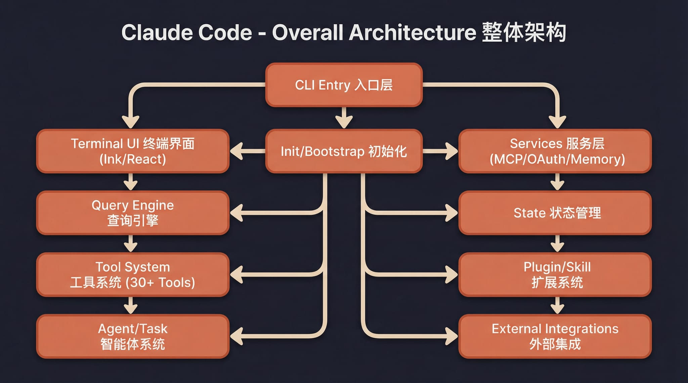
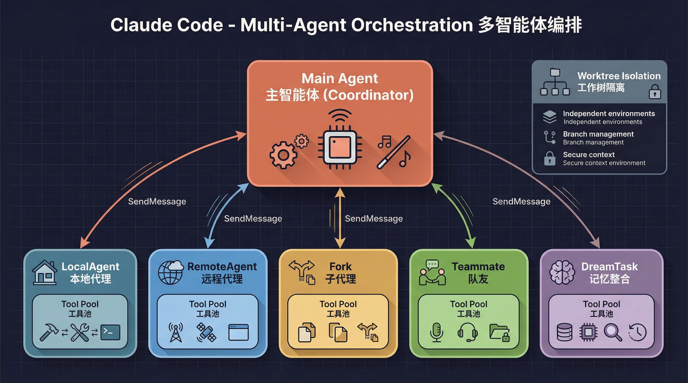

# Claude Code Token Free

<p align="center">
  
</p>

<div align="center">

[](https://github.com/hyqibot/claude-code-token-free/stargazers)
[](https://github.com/hyqibot/claude-code-token-free/network/members)
[](https://github.com/hyqibot/claude-code-token-free/issues)
[](https://github.com/hyqibot/claude-code-token-free/pulls)
[](https://github.com/hyqibot/claude-code-token-free/blob/main/LICENSE)
[](README.md)
[](README.en.md)

</div>

> **公开仓说明**：桌面安装包与更新见 [Releases](https://github.com/hyqibot/claude-code-token-free/releases)。**要使用免 Token（Zero-Token）功能，必须安装 Releases 里的桌面版**（内含预编译 sidecar）；公开源码无法自行构建完整 Zero-Token 网关。

Claude Code 永远免token费，基于 2026 年 3 月 31 日从 Anthropic 的 npm 仓库泄露的源代码修复构建的 Claude Code **本地可运行版本**，添加永久免token费模板，并构建成桌面版，尽情享受！

除了永久免token费的模型，支持接入任意 Anthropic 兼容 API（MiniMax、OpenRouter 等）。在完整 TUI 之外，还补全了 Computer Use（macOS / Windows）、打造了图形化**桌面端**，并支持通过 Telegram / 飞书 / 微信 / 钉钉**远程驱动**。

<p align="center">
  <a href="#桌面端简介">桌面端</a> · <a href="#功能">功能</a> · <a href="#架构概览">架构概览</a> · <a href="#快速开始">快速开始</a> · <a href="docs/guide/env-vars.md">环境变量</a> · <a href="docs/guide/faq.md">FAQ</a> · <a href="docs/guide/global-usage.md">全局使用</a> · <a href="#更多文档">更多文档</a>
</p>

  ---

## 桌面端简介

Claude Code Token Free 的桌面端把会话、多项目、代码 Diff、权限确认、提供商配置、定时任务和 IM 适配器集中到一个图形化工作台里，适合不想长期停留在终端里的日常开发工作流。

<p align="center">
  <a href="https://github.com/hyqibot/claude-code-token-free/releases"></a>
  &nbsp;
  <a href="docs/desktop/04-installation.md"></a>
</p>

---

## 功能

- 完整的 Ink TUI 交互界面（与官方 Claude Code 一致）
- `--print` 无头模式（脚本/CI 场景）
- 支持 MCP 服务器、插件、Skills
- 支持自定义 API 端点和模型（[第三方模型使用指南](docs/guide/third-party-models.md)）
- **记忆系统**（跨会话持久化记忆）— [使用指南](docs/memory/01-usage-guide.md)
- **多 Agent 系统**（多代理编排、并行任务、Teams 协作）— [使用指南](docs/agent/01-usage-guide.md) | [实现原理](docs/agent/02-implementation.md)
- **Skills 系统**（可扩展能力插件、自定义工作流）— [使用指南](docs/skills/01-usage-guide.md) | [实现原理](docs/skills/02-implementation.md)
- **IM 接入**（通过 Telegram / 飞书 / 微信 / 钉钉远程对话、切换项目和审批权限）— [接入指南](docs/im/)
- **Computer Use 桌面控制** — [功能指南](docs/features/computer-use.md) | [架构解析](docs/features/computer-use-architecture.md)
- **桌面端**（Tauri 2 + React 图形化客户端，多标签多会话）— [文档](docs/desktop/)

---

## 架构概览

<table>
  <tr>
    <td align="center" width="25%"><br><b>整体架构</b></td>
    <td align="center" width="25%"><br><b>请求生命周期</b></td>
    <td align="center" width="25%"><br><b>工具系统</b></td>
    <td align="center" width="25%"><br><b>多 Agent 架构</b></td>
  </tr>
  <tr>
    <td align="center" width="25%"><br><b>终端 UI</b></td>
    <td align="center" width="25%"><br><b>权限与安全</b></td>
    <td align="center" width="25%"><br><b>服务层</b></td>
    <td align="center" width="25%"><br><b>状态与数据流</b></td>
  </tr>
</table>


#### 快速开始

- **普通用户（推荐）**：到 [Releases](https://github.com/hyqibot/claude-code-token-free/releases) 下载 macOS / Windows / Linux 安装包，安装后打开桌面端即可。
- **免 Token（Zero-Token）**：**仅 Releases 安装包可用**；公开 clone / 自行 `bun run dev` / 本地打包 **不含** Zero-Token 网关 sidecar，无法使用免 Token 模型。
- **从源码运行**：见下方 [从源码运行](#从源码运行)；CLI 与桌面 Web UI 可本地调试，API Key 类 Provider 可用。

### 1. 安装 Bun

```bash
# macOS / Linux
curl -fsSL https://bun.sh/install | bash

# macOS (Homebrew)
brew install bun

# Windows (PowerShell)
powershell -c "irm bun.sh/install.ps1 | iex"
```

> 精简版 Linux 如提示 `unzip is required`，先运行 `apt update && apt install -y unzip`

### 2. 安装依赖并配置

```bash
bun install
cp .env.example .env
# 编辑 .env 填入你的 API Key，详见 docs/guide/env-vars.md
```

### 3. 启动

#### macOS / Linux

```bash
./bin/claude-haha                          # 交互 TUI 模式
./bin/claude-haha -p "your prompt here"    # 无头模式
./bin/claude-haha --help                   # 查看所有选项
```

#### Windows

> **前置要求**：必须安装 [Git for Windows](https://git-scm.com/download/win)

```powershell
# PowerShell / cmd 直接调用 Bun
bun --env-file=.env ./src/entrypoints/cli.tsx

# 或在 Git Bash 中运行
./bin/claude-haha
```

### 4. 全局使用（可选）

将 `bin/` 加入 PATH 后可在任意目录启动，详见 [全局使用指南](docs/guide/global-usage.md)：

```bash
export PATH="$HOME/path/to/claude-code-haha/bin:$PATH"
```

### 5. 桌面端联调（Desktop）

如果你在开发或测试 `desktop/` 前端，需要同时启动 API 服务端和桌面前端。

##方案A：

#### 5.1 启动服务端
终端 1 — Server（你已有）：

```bash
cd <project-root>

# macOS / Linux
SERVER_PORT=3456 bun run src/server/index.ts

# Windows PowerShell
$env:SERVER_PORT="3456"
bun run src/server/index.ts
```

用 Bun 跑 server 时，设置页「一键授权」会自动用 **Node 子进程** 执行 Playwright CDP（Bun 进程内连 9222 会超时卡住）。需本机 PATH 有 `node`（Node 22+）。

**首次**在 UI 里点「启动网关」（Zero-Token 3002）前，需在本机构建 sidecar 与 runtime（只需一次，或 gateway 代码变更后重跑）：

```powershell
cd D:\cc-haha\desktop
bun run build:sidecars
```

Server 会自动把 `--app-root` 指到 `desktop/build-artifacts`（不再误用 `~\.bun\bin`），sidecar 从同目录下的 `zero-token-runtime/` 加载 `gateway.bundle.mjs`。

DeepSeek 网页模型默认使用 **Doubao XML** 工具链（与豆包一致）；设置页可切到 DSML（可能被网页风控）。

可选自检：

```bash
curl http://127.0.0.1:3456/health
```

#### 5.2 启动桌面前端

“首次运行 desktop 前需在 desktop/ 执行 bun install”

终端 2 — 前端（你已有）：

```bash
cd <project-root>/desktop
bun run dev --host 127.0.0.1 --port 2024
```

终端 3 — 微信 adapter（缺这一步）：

cd D:\cc-haha\adapters
bun install
$env:ADAPTER_SERVER_URL="ws://127.0.0.1:3456"
bun run wechat

## 启动授权网关

```powershell
# 方式 A：仓库根目录（自动读 license-server/.env）
cd D:\cc-haha
bun run license-server

# 方式 B：仅部署了 license-server 目录时
cd D:\deploy\license-server
bun run src/index.ts
```

关闭3002端口进程
Get-NetTCPConnection -LocalPort 3002 -ErrorAction SilentlyContinue | Select-Object -ExpandProperty OwningProcess -Unique | ForEach-Object { Stop-Process -Id $_ -Force }

然后在浏览器打开：

```text
http://127.0.0.1:2024
```

##方案B：用 Tauri 桌面端（推荐日常使用）
winget install Rustlang.Rustup (Tauri 需要 Rust 的 cargo，但你当前系统里没有（或不在 PATH 里）)
cd D:\cc-haha\desktop
bun run tauri dev

或安装后的发布版桌面端。Tauri 会自动启动 server + claude-sidecar adapters --wechat，扫码绑定后会自动重启 adapter。


#### 从源码运行

公开仓可用于本地体验 **终端 CLI**、**桌面 Web UI** 与 **API Key 类 Provider**（OpenRouter、MiniMax 等）。更完整的命令说明见 [快速开始文档](docs/guide/quick-start.md)。

> **限制**：本仓库不含 Zero-Token 网关完整源码与预编译 sidecar，**无法**通过源码本地使用免 Token 功能；请安装 [Releases](https://github.com/hyqibot/claude-code-token-free/releases) 桌面版。

**环境要求**

- [Bun](https://bun.sh) 1.2+
- Windows 终端 CLI 需 [Git for Windows](https://git-scm.com/download/win)

**1. 克隆与安装**

```bash
git clone https://github.com/hyqibot/claude-code-token-free.git
cd claude-code-token-free
bun install
cd desktop && bun install && cd ..
```

如需调试 IM 适配器：`cd adapters && bun install`。

**2. 配置 API（可选）**

```bash
cp .env.example .env
# 编辑 .env 填入 API Key，见 docs/guide/env-vars.md
```

**3. 终端 CLI**

macOS / Linux（或 Windows Git Bash）：

```bash
./bin/claude-haha
./bin/claude-haha -p "your prompt"
```

Windows PowerShell：

```powershell
bun --env-file=.env ./src/entrypoints/cli.tsx
```

**4. 桌面 Web UI（浏览器，推荐源码调试）**

开两个终端：

```bash
# 终端 1：项目根目录 — API / WebSocket 服务端
# macOS / Linux / Git Bash
SERVER_PORT=3456 bun run src/server/index.ts

# Windows PowerShell
$env:SERVER_PORT=3456; bun run src/server/index.ts
```

```bash
# 终端 2：desktop 目录 — 前端
cd desktop
bun run dev --host 127.0.0.1 --port 2024
```

浏览器打开 [http://127.0.0.1:2024](http://127.0.0.1:2024)，在设置页配置 Provider / API Key 后即可聊天。

**说明**

- 公开仓 **不含** `vendor/copaw-zero-token/python/`，本地 `build:sidecars` / `tauri build` **不能**产出含 Zero-Token 的发行安装包。
- 贡献与本地质量门禁见 [贡献指南](docs/guide/contributing.md)。

#### 注意事项

- **IM 模型与桌面聊天页不同步？** 桌面端在任意聊天页切换模型时会自动同步到 `~/.claude/adapters.json` 的 `imRuntimeDefault`；IM 新建或复用 session 时会优先使用该配置。若全局激活的是 Zero-Token 但网关未启动，IM 会自动 fallback 到其他已配置 Provider。改模型后建议在 IM 里发 `/new` 或再发一条消息以确保会话已切换。详见 [IM 接入 — 模型说明](docs/im/index.md#5-im-使用的模型--provider)。
- **打包版 IM 扫码后仍提示未授权？** 发布版桌面端会为 server 与 adapter sidecar 统一注入 `CLAUDE_CONFIG_DIR`（指向 `%USERPROFILE%\.claude`）。微信扫码绑定后会自动授权绑定账号；钉钉绑定成功后会自动生成配对码，请把该码发给 Bot 完成用户授权。
- **聊天页 PNG/曲线图不显示？** 桌面端会把回复里的本地绝对路径（如 `D:\CCwork\xxx.png`）转为 `/api/filesystem/file` 加载。除用户主目录、session 工作区外，**会话 transcript 里出现过的输出目录**（如图表保存路径）也会自动放行。请刷新页面或重启 server 后重试；若仍失败，确认 PNG 文件确实存在且路径与回复中一致。
- 如果 `3456` 端口已经被旧服务端占用，先执行 `lsof -nP -iTCP:3456 -sTCP:LISTEN` 找到 PID，再 `kill <PID>`。
- 测试聊天时建议新建一个 session，并重新选择一个真实存在的工作目录。
- 如果某个旧 session 绑定的目录已被删除，服务端会返回 `Working directory does not exist`，这和服务端是否启动是两回事。
- **服务商页 Claude 官方登录**：点击「登录 Claude 账号」会优先调用桌面 shell 打开授权页；若系统禁止自动打开浏览器，页面会显示「打开授权链接」，手动点击后继续完成授权即可。


## 赞助与合作

欢迎企业或个人赞助支持持续开发，也可洽谈定制、集成或商务合作。

📧 **联系邮箱**：hyqi@tradey.dpdns.org
---

## ☕ 请作者喝杯咖啡

❤️❤️如果这个项目对您有帮助，欢迎打赏支持，您的每一份支持都是我持续更新的动力 ❤️❤️

<table>
<tr>
<td align="center" width="33%">
<br>
<b>微信赞赏</b>
</td>
<td align="center" width="33%">
<br>
<b>龙虾部落</b>
</td>
<td align="center" width="33%">
<a href="https://hyqibot.com/" target="_blank">

</a><br>
<b>Buy Me a Coffee</b>
</td>
</tr>
</table>

---

## 技术栈

| 类别 | 技术 |
|------|------|
| 运行时 | [Bun](https://bun.sh) |
| 语言 | TypeScript |
| 终端 UI | React + [Ink](https://github.com/vadimdemedes/ink) |
| CLI 解析 | Commander.js |
| API | Anthropic SDK |
| 协议 | MCP, LSP |

---

## 更多文档

| 文档 | 说明 |
|------|------|
| [在线文档站](https://hyqibot.github.io/claude-code-token-free/) | 公开仓 GitHub Pages（用户文档；`docs/reference/` 中开发者备忘不上线） |
| [环境变量](docs/guide/env-vars.md) | 完整环境变量参考和配置方式 |
| [第三方模型](docs/guide/third-party-models.md) | 接入 OpenAI / DeepSeek / Ollama 等非 Anthropic 模型 |
| [贡献与质量门禁](docs/guide/contributing.md) | 本地测试、真实模型 baseline、PR 和 release 门禁 |
| [记忆系统](docs/memory/01-usage-guide.md) | 跨会话持久化记忆的使用与实现 |
| [多 Agent 系统](docs/agent/01-usage-guide.md) | 多代理编排、并行任务执行与 Teams 协作 |
| [Skills 系统](docs/skills/01-usage-guide.md) | 可扩展能力插件、自定义工作流与条件激活 |
| [IM 接入](docs/im/) | 通过 Telegram / 飞书 / 微信 / 钉钉远程对话、切换项目和审批权限 |
| [Computer Use](docs/features/computer-use.md) | 桌面控制功能（截屏、鼠标、键盘）— [架构解析](docs/features/computer-use-architecture.md) |
| [桌面端](docs/desktop/) | Tauri 2 + React 图形化客户端 — [快速上手](docs/desktop/01-quick-start.md) \| [架构设计](docs/desktop/02-architecture.md) \| [安装指南](docs/desktop/04-installation.md) |
| [常见问题](docs/guide/faq.md) | 常见错误排查 |

---

## 感谢

感谢以下开源项目和社区实践为本项目提供参考与启发：

- [React](https://github.com/facebook/react)：前端工程与组件化 UI 生态。
- [Tauri](https://github.com/tauri-apps/tauri)：跨端桌面应用能力与工程实践。
- [cc-switch](https://github.com/farion1231/cc-switch)：模型供应商配置能力参考。

---

## ⭐ Star 趋势图

如果这个项目对您有帮助，请给个 ⭐ Star 支持一下，让更多的人看到 Claude Code Token Free！

<a href="https://www.star-history.com/#hyqibot/claude-code-token-free&Date">
  <picture>
    <source media="(prefers-color-scheme: dark)" srcset="https://api.star-history.com/svg?repos=hyqibot/claude-code-token-free&type=Date&theme=dark" />
    <source media="(prefers-color-scheme: light)" srcset="https://api.star-history.com/svg?repos=hyqibot/claude-code-token-free&type=Date" />
    
  </picture>
</a>

---

## Disclaimer

本仓库cc模块部分基于 2026-03-31 从 Anthropic npm registry 泄露的 Claude Code 源码，其原始源码版权归 [Anthropic](https://www.anthropic.com) 所有，修正版部分内容参考了https://github.com/NanmiCoder/cc-haha的开源项目。Free Token模块部分由HYQibot的Ai模型生成，商用需授权。 全部项目仅供学习和研究使用。
